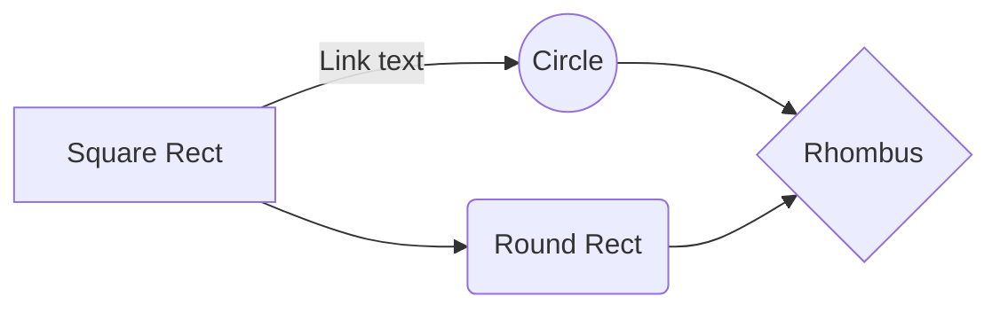

import { M6DocOrder } from '../../../src/constant/ouul';
import { HStack, Parameters } from '@docs/ui';

### 주문모델 (M6Doc)

주문결제가 되기 전까지는 type:[ORDER.NOTPAID] 상태이며, 주문결제가 완료되면 type:[ORDER] 상태로 변경됩니다.

#### status

- PAID
- ACCEPTED
- DELIVERING
- DELIVERED

#### substatus

- CANCELED:
- REFUNDED
- RETURN-ASKED
- RETURN-ACCEPTED
- RETURN-COMPLETED

### Order(M6Doc)

<Parameters title="데이터 형식" attributes={M6DocOrder} />
